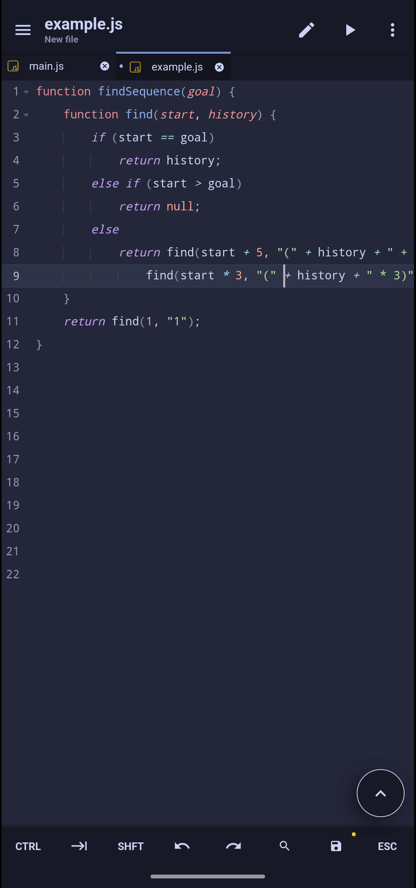
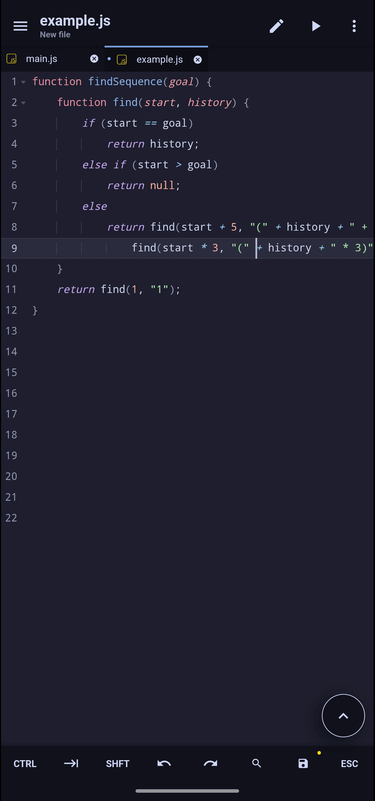

<h3 align="center">
	 
	
	Catppuccin for <a href="https://acode.app/">Acode</a>
	
</h3>

    😸 Soothing pastel theme for the high-spirited! Catppuccin theme port for <a href="https://acode.app">Acode</a> and <a href="https://ace.c9.io/">Ace Editor</a>.

	

## Previews

🌻 Latte

🪴 Frappé

🌺 Macchiato

🌿 Mocha

## Installation

1. Open Acode App, and search for "Catppuccin" in plugin store.
2. Install it!
3. Done :)

## Usage

Once installed, you can switch between flavors in Acode settings(`Acode App > Settings > Themes`). Each flavor has its own personality and color palette:

- **Latte** 🌞 - A light theme with soft, pastel colors perfect for well-lit environments.
- **Frappé** 🪴 - A dark theme with a muted color palette, excellent for coding in moderate lighting.
- **Macchiato** 🌺 - A rich dark theme with vibrant yet gentle colors, ideal for low-light settings.
- **Mocha** 🌿 - A deeper dark theme with intense, warm colors for a cozy night-time coding experience.

## Acknowledgements

This theme is inspired by and built upon the [Catppuccin](https://github.com/catppuccin/catppuccin) color scheme, a popular choice in developer communities for its soothing, eye-friendly colors. Special thanks to the Catppuccin team for their color palettes and inspiration. Its kind of port of Catppuccin fir Acode.

	

	

